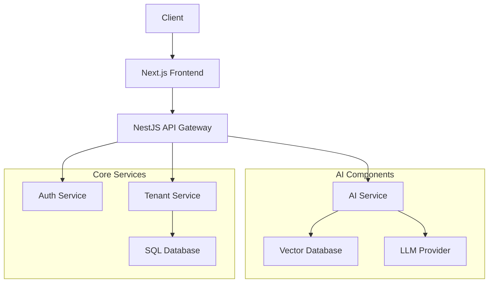

# NIA System Architecture

## High-Level Architecture

## Component Breakdown

### 1. Frontend (Next.js)

- **Chat Interface**: Interactive UI for user interactions
- **Document Management**: Upload and manage procurement documents
- **Admin Dashboard**: Monitor system health and usage metrics
- **Authentication Flow**: Login, registration, and session management

### 2. Backend Services (NestJS)

#### API Gateway

- Request routing and aggregation
- Rate limiting and throttling
- Request/response transformation
- API versioning

#### AI Service

- Document processing and ingestion
- Vector embeddings generation
- Context-aware response generation
- Conversation management

#### Auth Service

- User authentication (JWT, OAuth2)
- Session management
- Token refresh flow
- Social login integration

#### Tenant Service

- Tenant isolation
- Resource allocation
- Billing and subscription management
- User-tenant mapping

### 3. Data Layer

#### Vector Database (Pinecone)

- Stores document embeddings
- Enables semantic search
- Multi-tenant data isolation
- High-performance similarity search

#### SQL Database (PostgreSQL)

- User profiles and permissions
- Document metadata
- Conversation history
- System configurations

#### Object Storage (S3 Compatible)

- Original document storage
- Processed text storage
- Versioned document backups

## Data Flow

### Document Ingestion Flow

1. User uploads document through frontend
2. File stored in object storage
3. Document processor extracts text and metadata
4. Text split into chunks and converted to embeddings
5. Embeddings stored in vector database with metadata
6. Document metadata stored in SQL database

### Query Processing Flow

1. User submits query through chat interface
2. Query converted to embedding
3. Vector database searches for similar content
4. Relevant context retrieved and formatted
5. LLM generates response using context
6. Response streamed back to user

## Security Considerations

### Data Protection

- Encryption at rest and in transit
- Field-level encryption for sensitive data
- Regular security audits

### Access Control

- Role-based access control (RBAC)
- Attribute-based access control (ABAC)
- Row-level security in database

### Compliance

- GDPR compliance
- Data residency requirements
- Audit logging

## Scalability Design

### Horizontal Scaling

- Stateless services for easy scaling
- Database read replicas
- Caching layer (Redis)

### Performance Optimization

- Edge caching for static assets
- Database indexing strategy
- Query optimization

## Monitoring and Observability

### Logging

- Structured logging with correlation IDs
- Centralized log management
- Log retention policies

### Metrics

- System performance metrics
- Business metrics
- Custom application metrics

### Tracing

- Distributed tracing
- Performance bottleneck identification
- End-to-end request tracking

## Deployment Architecture

### Development Environment

- Local development with Docker
- Feature branch deployments
- Automated testing

### Staging Environment

- Mirrors production
- Integration testing
- Performance testing

### Production Environment

- Multi-region deployment
- Auto-scaling
- Blue-green deployments

## Technology Stack

### Frontend

- Next.js 14
- TypeScript
- Tailwind CSS
- Vercel AI SDK

### Backend

- NestJS
- TypeORM/Prisma
- Redis (caching)
- BullMQ (queue)

### AI/ML

- OpenAI API
- Pinecone (vector database)
- LangChain (optional)

### Infrastructure

- Docker
- Kubernetes
- AWS/GCP/Azure
- Terraform (IaC)

## Implementation Roadmap

### Week 1-2: Foundation

- Basic chat interface
- Document upload and processing
- Simple RAG implementation

### Week 3-4: Core Features

- Multi-tenancy
- Advanced document processing
- User management
- Basic analytics

### Week 5: Polish & Launch

- Performance optimization
- Security hardening
- Documentation
- Production deployment

## Risk Mitigation

### Technical Risks

1. **Vector Database Performance**

   - Mitigation: Implement caching and query optimization
   - Fallback: Hybrid search (lexical + semantic)

2. **LLM Costs**

   - Mitigation: Implement usage quotas
   - Fallback: Use smaller models where possible

3. **Data Privacy**
   - Mitigation: On-premise deployment option
   - Fallback: Data anonymization

### Business Risks

1. **Adoption**

   - Mitigation: User training and documentation
   - Fallback: Phased rollout

2. **Integration**
   - Mitigation: API-first design
   - Fallback: Manual data import/export
